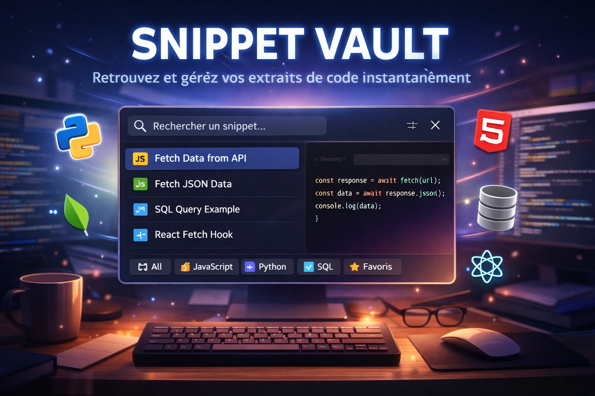
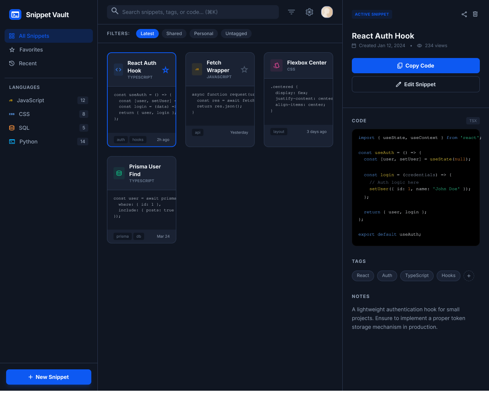
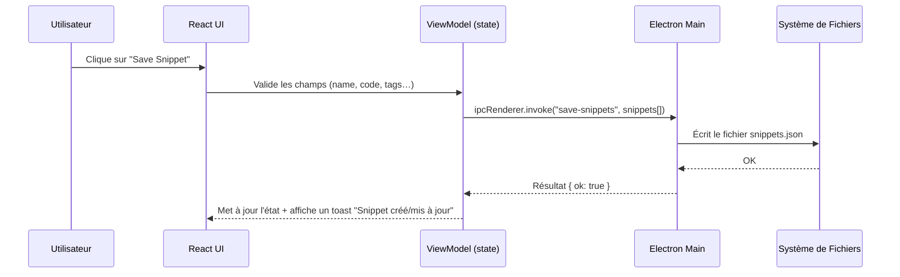
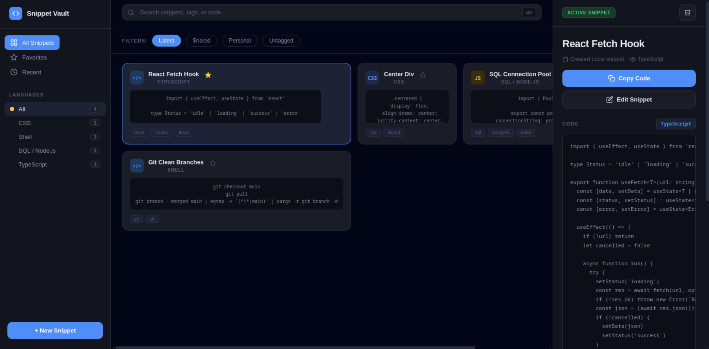

# Snippet Vault



## 👥 Auteur
* **BRANCO Aurélien** (Rôle : Desktop & Frontend Dev) - https://github.com/baskaure/snippet-vault-electron

---

## 📄 Description
Snippet Vault est une application desktop légère qui permet aux développeurs de retrouver instantanément leurs extraits de code (snippets) et de les copier en un raccourci clavier.  
L’application se présente comme un lanceur type Spotlight/Raycast : une petite fenêtre élégante, centrée, avec recherche en temps réel, filtres par langage, favoris et panneau de détails avec prévisualisation du code. Elle cible principalement les développeurs web / backend, étudiants et freelances qui jonglent avec beaucoup de snippets au quotidien.

### Fonctionnalités Clés

> ⚠️ **Focus Desktop :** L’application Electron enregistre un **raccourci clavier global** (`Ctrl+Shift+S`) pour ouvrir/masquer la fenêtre depuis n’importe où, et utilise le **presse‑papiers du système** via l’API native d’Electron pour copier le code du snippet sélectionné.

* [x] Recherche instantanée de snippets (nom, description, langage, tags)
* [x] Copie du code dans le presse‑papiers (Entrée ou bouton "Copy Code")
* [x] Gestion locale des snippets (JSON) : création, édition, suppression, favoris
* [x] Filtres par langage et par type (Latest / Shared / Personal / Untagged)
* [x] Navigation clavier (↑/↓ pour changer de snippet, Entrée pour copier, Esc pour fermer)
* [ ] Synchronisation cloud / partage multi‑machines

## 🎨 Conception & Design
> Lien vers la maquette complète (Figma ou Penpot).  
> **[Voir la maquette sur Figma](https://www.figma.com/design/2ApQHrTrsX9R9WxLLvdubc/snippet?node-id=1-130&t=6MGmYBqtc3iABLJ5-1)**  

L’interface reproduit fidèlement une maquette de type Raycast : sidebar avec filtres, grille de cartes au centre, panneau de détails à droite.  



## 📐 Architecture & UML
L’architecture suit une approche **MVVM simplifiée** :

- **Electron Main (Backend Desktop / “Model + Service”)**  
  - Gère la fenêtre, le raccourci global, l’accès au système de fichiers (`snippets.json`) et au presse‑papiers.  
  - Expose des canaux IPC (`get-snippets`, `save-snippets`, `copy-snippet-to-clipboard`, `hide-window`).

- **Renderer React (Vue + ViewModel)**  
  - `App.tsx` joue le rôle de **ViewModel + View racine** : il maintient l’état (snippets, filtres, snippet actif, formulaire d’édition) et pilote les sous‑zones de l’UI (sidebar, barre de recherche, grille, détail).  
  - La logique métier (filtrage, tri, favoris, CRUD) est centralisée dans des hooks/`useMemo`, séparée du code Electron.

Diagramme de séquence (Mermaid) pour la sauvegarde d’un snippet :



## 🛠 Stack Technique
* **Langage :** TypeScript
* **Framework Desktop :** Electron 33
* **Frontend :** React 18 + Vite
* **Styling :** CSS custom (inspiré Raycast/Spotlight)
* **Outils :** VS Code / Cursor, Git & GitHub, Figma/Stitch pour la maquette

---

## 📸 Démonstration (Screenshots & Gifs)
> Une image vaut mille mots, une animation en vaut dix mille.  
> Remplacer les chemins par de vraies captures avant rendu final.

| Écran d'accueil | Démo Interaction (Gif) (pas réussi à faire de gif dsl) |
| :---: | :---: |
|  |

---

## 🚀 Installation & Lancement

```bash
# Cloner le dépôt
git clone https://github.com/baskaure/snippet-vault-electron
cd snippet-vault-electron

# Installer les dépendances
npm install

# Lancer l'application en mode développement
npm run dev

# Build (binaire desktop via electron-builder)
npm run build
```

> Prérequis : Node.js LTS installé sur la machine.  
> Le fichier `snippets.json` à la racine contient les snippets initiaux et sera mis à jour par l'application.

---

## 🤖 Section IA & Méthodologie (OBLIGATOIRE)

### 1. Prompts Utilisés (exemples représentatifs)
- _"Adapte cette maquette HTML/CSS en composant React fonctionnel."_  
- _"Comment enregistrer un raccourci clavier global et accéder au presse-papier avec Electron ?"_  

### 2. Modifications Manuelles & Debug
- Revue manuelle de tout le code généré pour respecter le design exact de la maquette (ajustement des classes CSS, des paddings, de l’alignement).  
- Correction de plusieurs problèmes de JSX (caractères `{` et `>` dans les blocs de code, erreurs de typage TypeScript sur les handlers clavier).  
- Refactor progressif de `App.tsx` pour intégrer la logique réelle (chargement JSON, IPC, CRUD) tout en conservant l’UI de la maquette.  
- Ajout manuel de protections (vérification `name` et `code` avant sauvegarde, confirmation avant suppression, gestion d’erreurs IPC).

### 3. Répartition Code IA vs Code Humain (approximation honnête)
- **Boilerplate Electron + Vite + React :** 70–80 % IA (template de base + ajustements).  
- **Logique Métier (chargement JSON, filtres, favoris, CRUD) :** 50 % IA (première version) puis 20 % IA 2eme retravaillé/corrigé à la main.  
- **Interface (UI détaillée Raycast‑like) :** Maquette HTML/CSS fournie puis adaptée en React avec aide IA, ajustée manuellement pour coller au comportement attendu.

---

## ⚖️ Auto-Évaluation
- **Ce qui fonctionne bien :**  
  - Flux principal très fluide (raccourci global → recherche → sélection → copie).  
  - Stockage local simple et transparent via un `snippets.json` éditable.  
  - UI propre, cohérente, avec une vraie expérience type outil pro (fav, filtres, clavier, toasts).

- **Difficultés rencontrées :**  
  - Gestion fine de l’IPC (typage TypeScript, erreurs silencieuses à la lecture/écriture du JSON).  
  - Intégration de la maquette HTML/CSS dans un composant React tout en gardant le JSX valide.  
  - Navigation clavier globale sans casser la saisie dans les formulaires d’édition.

- **Si c'était à refaire :**  
  - Découper plus tôt l’app en composants (`Sidebar`, `SnippetList`, `DetailPanel`) pour alléger `App.tsx`.  
  - Ajouter une vraie couche de “modèle” dédiée (service `SnippetRepository`) pour isoler totalement la logique du stockage.  
  - Aller plus loin sur les fonctionnalités desktop natives (ex. notifications système, icône System Tray) et sur la synchronisation cloud.

